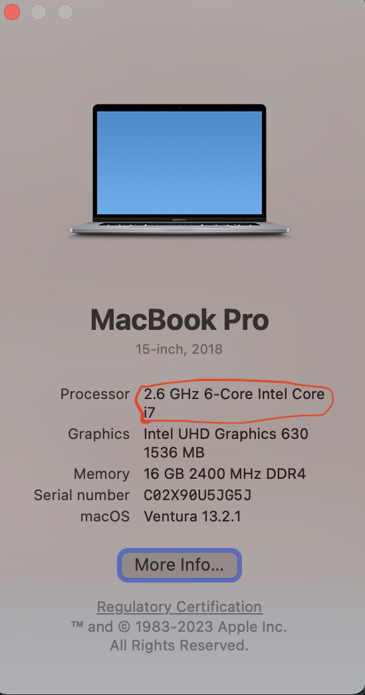
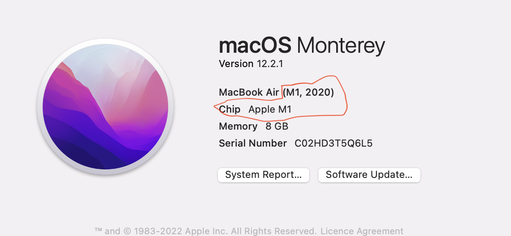
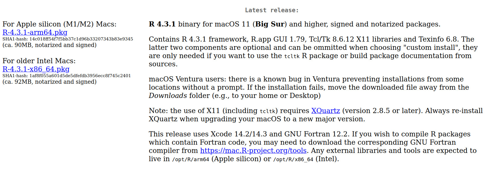

## Introduction

There will be two practical bioinformatics workshops delivered at the 2023 Summer School:

* **Introduction to R**  
    * Monday 18th at 2:30-5:30 PM  
    * Tuesday 19th at 1:00-5:00 PM  
    * Wednesday 20th at 1:00-5:00 PM  

* **Differential Gene Expression Analysis of RNAseq data with DESeq2 in R**  
    * Thursday 21st at 1:30-5:30 PM
    * Friday 22nd at 1:00-5:00 PM

:::box

#### **Essential** 

For both workshops you will need to bring a laptop with **R** and **RStudio**
already installed along with the necessary R packages.

You should also download the necessary data for the workshop(s) you are
attending.

This document contains instructions for carrying out the above tasks.

If you have any difficulty installing any of the software then please contact
XXXXXXXXXXXXX for help.

**Please do this as soon as you can, in order to give yourself time to overcome
any problems in the installation**

:::

## Installing R and RStudio

**R** and **RStudio** are separate downloads and installations.

**R** is the underlying statistical computing environment. The base R system
and a very large collection of packages that give you access to a huge range of
statistical and analytical functionality are available from
[CRAN](https://cran.r-project.org), the Comprehensive R Archive Network.

**RStudio** is a graphical integrated development environment (IDE) that makes
using R much easier and more interactive. 

You need to first install R before you install RStudio. The instructions are
slightly different depending on your operating system/computer platform. Please
use the relevant instruction below.

### Windows

#### **If you don't have R and RStudio installed**

First install R:

* Download the current version of R (version 4.3.1 as of 06/09/2023) from the
  [CRAN website](https://cran.r-project.org/bin/windows/base).  
* Run the `.exe` file that was just downloaded to install R

Now install RStudio:

* Go to the [RStudio download page](https://posit.co/download/rstudio-desktop/#download)
* Under *Installers* select **RStudio-2023.06.2-561.exe**
* Double click the file to install it
* Once it's installed, open RStudio to make sure it works and you don't get any error messages.

#### **If you already have R and RStudio installed**

You should make sure that you are running the latest versions of R and Rstudio.

First check RStudio and update if necessary:

* Open RStudio, and click on `Help` in the menu bar and then `Check for updates`. 
  
If a new version is available, quit RStudio, and download the latest version
for RStudio.

To check which version of R you are using, start RStudio and the first thing
that appears in the console indicates the version of R you are running.
Alternatively, you can type `sessionInfo()`, which will also display which
version of R you are running. Now go to the
[CRAN website](https://cran.r-project.org/bin/windows/base/) and check whether
a more recent version is available. 

If so, please download and install it as described above. 

It is not essential to remove older versions of R, but if you wish to you can
[check here](https://cran.r-project.org/bin/windows/base/rw-FAQ.html#How-do-I-UNinstall-R_003f)
for information on how to remove old versions from your system.

### macOS

#### If you don't have R and RStudio installed

Apple MacBooks come with one of two types of cpu (chip). A different version of
R needs to be installed depending on the type of chip running your MacBook. So,
the first thing you should do is check what chip your Mac has.

To this, click on Apple logo in top left of the screen, then chick on `About This Mac`.
Check to see whether you have an "Intel" or an "Apple M1" chip:
  

Now download the version R for your chip from the 
[CRAN website](https://cran.r-project.org/bin/macosx/). If you have an "Intel" chip you need
"R-4.3.1-x86_64.pkg", if you have an "Apple M1" chip you need "R-4.3.1-arm64.pkg":
  

* Select appropriate R `.pkg` file for the latest R version
  * For M type chip: download `R-4.3.1-arm64.pkg`
  * For inter chip: download `R-4.3.1-x86_64.pkg"

* Double click on the downloaded file to install R
* It is also a good idea to install [XQuartz](https://www.xquartz.org/) (needed
  by some packages)

Now install RStudio:

* Go to the [RStudio download
  page](https://posit.co/download/rstudio-desktop/#download)
* Under *Installers* select **Mac OS 11+ RStudio-2023.06.2-561.DMG**
* Double click the file to install RStudio
* Once it's installed, open RStudio to make sure it works and you don't get any error messages.

#### If you already have R and RStudio installed

* Open RStudio, and click on "Help" > "Check for updates". 
  
If a new version is available, quit RStudio, and download the latest version for RStudio.

To check the version of R you are using, start RStudio and the first thing that
appears on the terminal indicates the version of R you are running.
Alternatively, you can type `sessionInfo()`, which will also display which
version of R you are running. 
Now go to the [CRAN website](https://cran.r-project.org/bin/macosx/) and check
whether a more recent version is available. If so, please download and install
it as described above.

## Installing packages and downloading data for the "R intro" workshop

In the "R intro" workshop we will be learning how to work with data using a
suite of packages collectively known as "the tidyverse". This is includes
packages such as `readr`, `dplyr` and ``ggplot2`. Rather than install each
package separately we can conveniently install them all at once by installing
the `tidyverse` package.

To install the `tidyverse` packages:

* Start RStudio, at the console type:
  `install.packages("tidyverse")`

* You can also do this by going to Tools -> Install Packages and typing the names of the packages separated by a comma.

