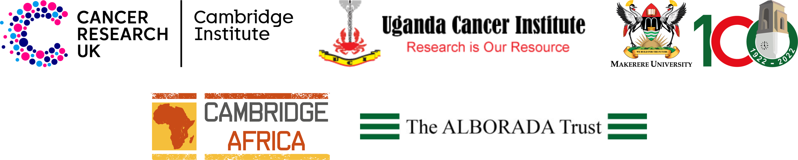

{width=100%}

# Introduction  {.unlisted .unnumbered}

There will be two practical bioinformatics workshops delivered at the 2023 Summer School:

* **Introduction to R**  
    * Monday 18th at 2:30-5:30 PM  
    * Tuesday 19th at 1:00-5:00 PM  
    * Wednesday 20th at 1:00-5:00 PM  

* **Differential Gene Expression Analysis of RNAseq data with DESeq2 in R**  
    * Thursday 21st at 1:30-5:30 PM
    * Friday 22nd at 1:00-5:00 PM

:::box

#### **Essential**  {-}

For both workshops you will need to bring a laptop with all the necessary
software and data files for the workshop. 

Before attending the workshops you will need to:

1. Install **R** and **RStudio**
2. Install the `tidyverse` R package (necessary for both workshops)
2. Install the necessary R packages for the RNAseq workshop, if you are attending
3. Download the necessary data for the workshops.

This document contains instructions for carrying out the above tasks.

If you have any difficulty installing any of the software then please contact
XXXXXXXXXXXXX for help.

**Please do this as soon as you can, in order to give yourself time to overcome
any problems in the installation**

:::

# Installing R and RStudio {.tabset}

**R** and **RStudio** are separate downloads and installations.

**R** is the underlying statistical computing environment. The base R system
and a very large collection of packages that give you access to a huge range of
statistical and analytical functionality are available from
[CRAN](https://cran.r-project.org), the Comprehensive R Archive Network.

**RStudio** is a graphical integrated development environment (IDE) that makes
using R much easier and more interactive. 

You need to first install R before you install RStudio. The instructions are
slightly different depending on your operating system/computer platform. Please
use the relevant instruction below.

If you already have R and RStudio installed on your laptop, please make sure they
are both up to date and update any packages that you already have installed.

## Installation on Windows

### Installing R {-}

1. Download the current version of R (version 4.3.1 as of 06/09/2023) from the
  [CRAN website](https://cran.r-project.org/bin/windows/base).  
2. Double click the `.exe` file that was just downloaded to launch it and install R

### Installing RStudio {-}

1. Go to the [RStudio download page](https://posit.co/download/rstudio-desktop/#download)
2. Under *Installers* download **RStudio-2023.06.2-561.exe**
3. Double click the file to install it


## Software Installation on Apple MacBook

### Installing R {-}

Apple MacBooks come with one of two types of cpu (chip) - Intel or Apple M1/M2.
A different version of R needs to be installed depending on the type of chip
that is running your MacBook. So, the first thing you should do is check what
chip your Mac has.  Once you know this, you can download the relevant R version
and install it.

1. Click on Apple logo in top left of the screen, then chick on 
   `About This Mac`.  Check to see whether you have an "Intel" or an "Apple M"
   chip:
  
<center>
{width=90%}
</center>
<br/><br/>

2. Download the appropriate version of R for your chip from the [CRAN
website](https://cran.r-project.org/bin/macosx/):
  
<center>
{width=90%}
</center>

3. Double click on the downloaded file to install R

### Installing XQuartz {-}

In order to run RStudio on Mac OS you will need to install an additional piece
of software - XQuartz.

1. Download the `.pkg` file from [XQuartz](https://www.xquartz.org/).
3. Double click the downloaded file to install XQuartz 

### Installing RStudio {-}

Finally install RStudio:

1. Go to the [RStudio download
  page](https://posit.co/download/rstudio-desktop/#download)
2. Under *Installers* select **Mac OS 11+ RStudio-2023.06.2-561.DMG**
3. Double click the donwloaded file to install RStudio


## Updating R and RStudio if they are already installed

If you already have R and RStudio installed, you should make sure that you are
running the latest versions.

First check RStudio and update if necessary. Open RStudio, and click on `Help`
in the menu bar and then `Check for updates`. 

To check which version of R you are using, it is the first thing that appears
in the console. If your version of R is older than version 4.3.0.

<center>
{width=80%}
</center>

If either R or RStudio requires updating, close RStudio and then folow the
relevant installation instructions for your platform (Windows or macOS).

# Installing the `tidyverse` R package 

In the "R intro" workshop we will be learning how to work with data using a
suite of packages collectively known as "the tidyverse". This is includes
packages such as `readr`, `dplyr` and `ggplot2`. Rather than install each
package separately we can conveniently install them all at once by installing
the `tidyverse` package.

To install the `tidyverse` packages:

Start RStudio, at the console type 

```{r eval = FALSE}
install.packages("tidyverse")
```

 and then press `Enter`:

<center>

{width=80%}
  
  
{width=60%}

</center>


You should then see some messages as the tidyverse is installed:

<center>
{width=60%}
</center>

Finally, check that the tidyverse has been installed by loading it
from your library. To do this, at the console type:

```{r eval = FALSE}
library(tidyverse)
```

and press `Enter`. You should see the following message (or similar):

<center>
{width=60%}
</center>

# Installing packages for the "Differential Gene Expression Analysis" workshop

For the "Differential Gene Expression Analysis of RNAseq data with DESeq2 in R"
workshop we will need a number of packages. Some are specific for differential
gene expression analysis, others for annotation of genes based on gene IDs and
other are simply helper packages for creating plots. Many of the packages
we will be using come from the [Bioconductor](https://bioconductor.org/)
project. Bioconductor is an open project that curates R packages specifically
for analysis of biological data. Bioconductor packages are kept in a different
repository to CRAN packages (such as the tidyverse, which you should have
already installed) and so require a different function to install them.

Before installing the packages we need, we must first install the latest version
of Bioconductor. **It is essential that your R and RStudio are up to date
before doing this.** It is not possible to install the current version of
Bioconductor in older versions of R.

## Install Bioconductor

1. First we need to install the `BiocManager` package. Start RStudio, at the
   console run the command:

```{r eval = FALSE}
install.packages("BiocManager")
```

2. Now we can install Bioconductor. At the console type:

```{r eval = FALSE}
BiocManager::install(version = "3.17")
```

If this is the first time you are installing Bioconductor, it can take some time. 

## Install Packages

Although we are going to be installing packages from both CRAN and Bioconductor
we can use `BiocManager::install` to install all the packages - it will figure
out whether to use CRAN or Bioconductor for each package.

1. To install all of the packages we need for the RNAseq course, type (or
   copy/paste) the following command into the console.

```{r eval = FALSE}
BiocManager::install(c("AnnotationDbi", "AnnotationHub", "circlize",
                       "clusterProfiler", "ComplexHeatmap", "DESeq2",
                       "enrichplot", "ensembldb", "gganimate", "ggdendro",
                       "ggfortify", "ggrepel", "ggvenn", "msigdbr",
                       "org.Mm.eg.db", "pathview", "tximport")) 
```

Again, it may take some time to install all of the packages.

2. Once the installation is complete, type (or copy/paste) each of the following
   lines to ensure you have correctly installed all the packages.
   
```{r eval = FALSE}
library(AnnotationDbi)
library(AnnotationHub)
library(circlize)
library(clusterProfiler)
library(ComplexHeatmap)
library(DESeq2)
library(enrichplot)
library(ensembldb)
library(gganimate)
library(ggdendro)
library(ggfortify)
library(ggrepel)
library(ggvenn)
library(msigdbr)
library(org.Mm.eg.db)
library(pathview)
library(tidyverse)
library(tximport)
```

If a package has not installed correctly you will get a message similar to this:

{width=60%}

# Downloading the Data

We will need various data files for the workshops. These can all be downloaded
in a single zip file from 
[here](https://bioinformatics-core-shared-training.github.io/Reverse_Summer_School_2023_PreCourse/Bioinformatics_workshop_data.zip).


Please download this file and unzip in a suitable location on your laptop. We
will be working within this folder for the duration of the workshops.


