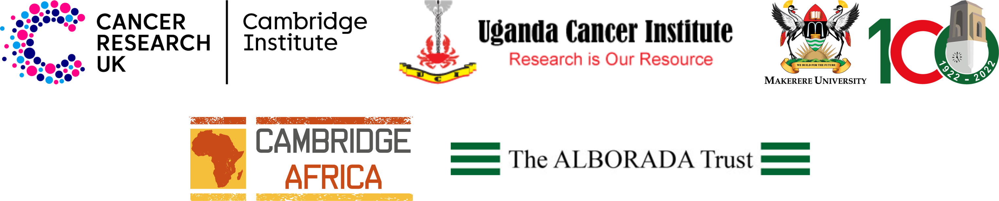

# Cambridge Makerere Summer School
## Essential preparations prior to attending Bioinformatics workshop
### Ashley Sawle
### 6th September 2023

There will be two practical bioinformatics workshops delivered at the 2023 Summer School:

* **Introduction to R**  
    * Monday 18th at 2:30-5:30 PM  
    * Tuesday 19th at 1:00-5:00 PM  
    * Wednesday 20th at 1:00-5:00 PM  

* **Differential Gene Expression Analysis of RNAseq data with DESeq2 in R**  
    * Thursday 21st at 1:30-5:30 PM
    * Friday 22nd at 1:00-5:00 PM

## **Essential Actions** 

For both workshops you will need to bring a laptop with all the necessary
software and data files for the workshop. 

Before attending the workshops you must:

1. [Install **R** and **RStudio**]()
2. [Install the `tidyverse` R package (necessary for both workshops)]()
2. [Install the necessary R packages for the RNAseq workshop, if you are attending]()
3. [Download the necessary data for the workshops]()

This documents linked above contain instructions for carrying out each of tasks.

If you have any difficulty installing any of the software then please contact
XXXXXXXXXXXXX for help.

